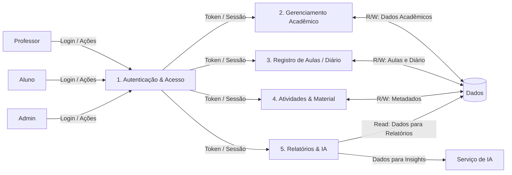

```mermaid

flowchart LR
    %% Entidades Externas
    Professor[Professor]
    Aluno[Aluno]
    Admin[Admin]
    IA[Serviço de IA]

    %% Processos (Retângulos)
    P1[1. Autenticação & Acesso]
    P2[2. Gerenciamento Acadêmico]
    P3[3. Registro de Aulas / Diário]
    P4[4. Atividades & Material]
    P5[5. Relatórios & IA]

    %% Data Store (Cilindro)
    DS1[(Dados)]

    %% 1. Fluxo de Usuários para P1
    Professor -->|Login / Ações| P1
    Aluno -->|Login / Ações| P1
    Admin -->|Login / Ações| P1

    %% 2. Fluxo de P1 para Processos
    P1 -->|Token / Sessão| P2
    P1 -->|Token / Sessão| P3
    P1 -->|Token / Sessão| P4
    P1 -->|Token / Sessão| P5

    %% 3. Fluxo de Processos e Banco de Dados
    P2 <-->|R/W: Dados Acadêmicos| DS1
    P3 <-->|R/W: Aulas e Diário| DS1
    P4 <-->|R/W: Metadados| DS1
    P5 -->|Read: Dados para Relatórios| DS1

    %% 4. Integrações Externas
    P5 -->|Dados para Insights| IA

```