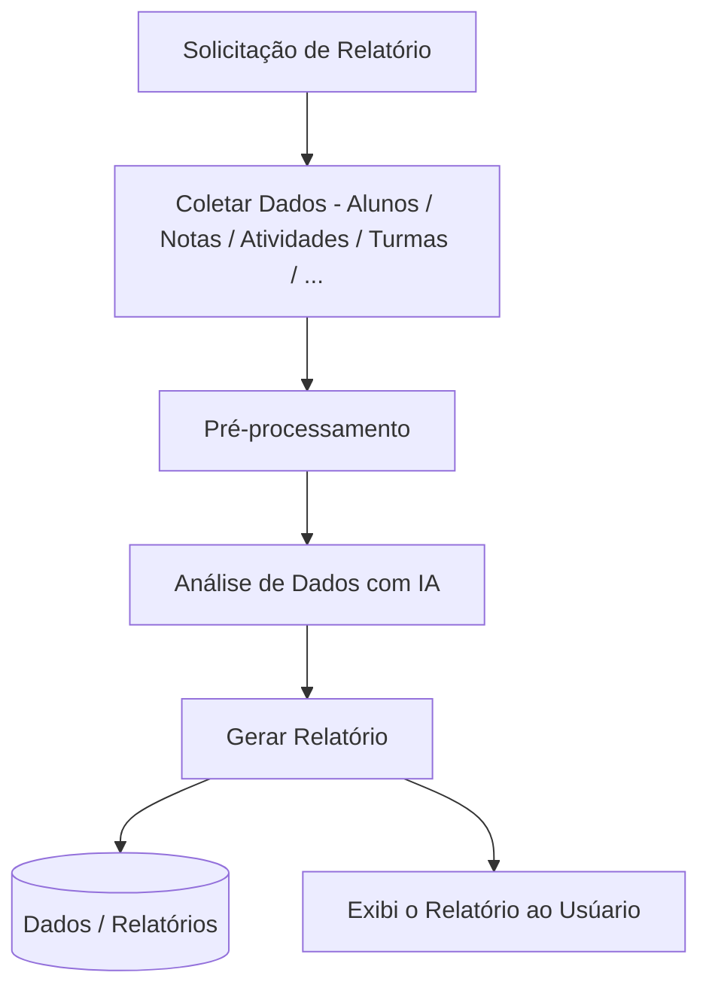

```mermaid
flowchart TB
  Pedido[Solicitação de Relatório] --> P5_1[Coletar Dados - Alunos / Notas / Atividades / Turmas / ...]
  P5_1 --> P5_2[Pré-processamento]
  P5_2 --> P5_3[Análise de Dados com IA]
  P5_3 --> P5_4[Gerar Relatório]
  P5_4 --> DS6[(Dados / Relatórios)]
  P5_4 --> Exibicao[Exibi o Relatório ao Usúario]
```