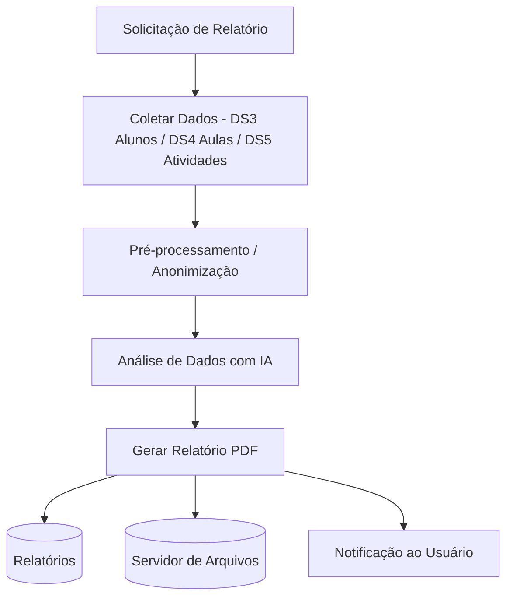

```mermaid
flowchart TB
  Pedido[Solicitação de Relatório] --> P5_1[Coletar Dados - DS3 Alunos / DS4 Aulas / DS5 Atividades]
  P5_1 --> P5_2[Pré-processamento / Anonimização]
  P5_2 --> P5_3[Análise de Dados com IA]
  P5_3 --> P5_4[Gerar Relatório PDF]
  P5_4 --> DS6[(Relatórios)]
  P5_4 --> Arquivos[(Servidor de Arquivos)]
  P5_4 --> Notificacao[Notificação ao Usuário]
```