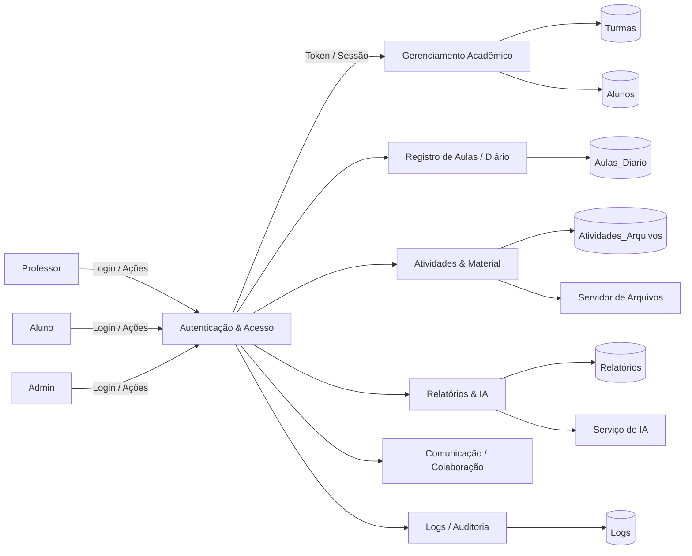

```mermaid
flowchart LR
  Professor -->|Login / Ações| P1[Autenticação & Acesso]
  Aluno -->|Login / Ações| P1
  Admin -->|Login / Ações| P1

  P1 -->|Token / Sessão| P2[Gerenciamento Acadêmico]
  P1 --> P3[Registro de Aulas / Diário]
  P1 --> P4[Atividades & Material]
  P1 --> P5[Relatórios & IA]
  P1 --> P6[Comunicação / Colaboração]
  P1 --> P7[Logs / Auditoria]

  %% Data Stores
  P2 --> DS2[(Turmas)]
  P2 --> DS3[(Alunos)]
  P3 --> DS4[(Aulas_Diario)]
  P4 --> DS5[(Atividades_Arquivos)]
  P5 --> DS6[(Relatórios)]
  P7 --> DS7[(Logs)]

  %% Integrações externas
  P4 --> Arquivos[Servidor de Arquivos]
  P5 --> IA[Serviço de IA]
```
