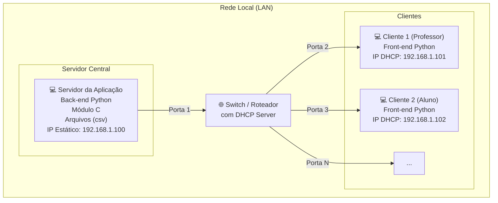

```mermaid
graph TD
    subgraph "Rede Local (LAN)"

        subgraph "Servidor Central"
            SERV_APP["💻 Servidor da Aplicação<br>Back-end Python<br>Módulo C<br>Arquivos (csv)<br>IP Estático: 192.168.1.100"]
        end

        subgraph "Clientes"
            CLI_PROF["💻 Cliente 1 (Professor)<br>Front-end Python<br>IP DHCP: 192.168.1.101"]
            CLI_ALUNO["💻 Cliente 2 (Aluno)<br>Front-end Python<br>IP DHCP: 192.168.1.102"]
            CLI_N["..."]
        end

        SWITCH["🌐 Switch / Roteador<br>com DHCP Server"]

        SERV_APP -- "Porta 1" --> SWITCH
        SWITCH -- "Porta 2" --> CLI_PROF
        SWITCH -- "Porta 3" --> CLI_ALUNO
        SWITCH -- "Porta N" --> CLI_N

    end
```