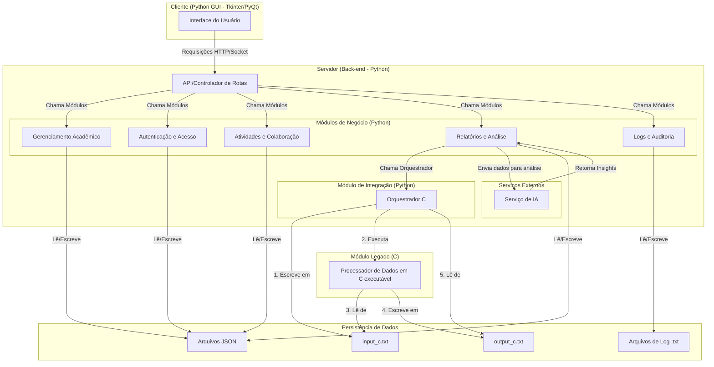

```mermaid
graph TD
    subgraph "Cliente (Python GUI - Tkinter/PyQt)"
        A[Interface do Usuário]
    end

    subgraph "Servidor (Back-end - Python)"
        B[API/Controlador de Rotas]

        subgraph "Módulos de Negócio (Python)"
            C[Gerenciamento Acadêmico]
            D[Autenticação e Acesso]
            E[Atividades e Colaboração]
            F[Relatórios e Análise]
            G[Logs e Auditoria]
        end

        subgraph "Módulo de Integração (Python)"
            H[Orquestrador C]
        end

        subgraph "Serviços Externos"
            I[Serviço de IA]
        end
    end

    subgraph "Persistência de Dados"
        J[Arquivos JSON]
        K[Arquivos de Log .txt]
        K_in[input_c.txt]
        K_out[output_c.txt]
    end

    subgraph "Módulo Legado (C)"
        L[Processador de Dados em C executável]
    end

    A -- "Requisições HTTP/Socket" --> B
    B -- "Chama Módulos" --> C
    B -- "Chama Módulos" --> D
    B -- "Chama Módulos" --> E
    B -- "Chama Módulos" --> F
    B -- "Chama Módulos" --> G

    C -- "Lê/Escreve" --> J
    D -- "Lê/Escreve" --> J
    E -- "Lê/Escreve" --> J
    G -- "Lê/Escreve" --> K

    F -- "Chama Orquestrador" --> H
    F -- "Envia dados para análise" --> I
    I -- "Retorna Insights" --> F
    F -- "Lê/Escreve" --> J

    H -- "1. Escreve em" --> K_in
    H -- "2. Executa" --> L
    L -- "3. Lê de" --> K_in
    L -- "4. Escreve em" --> K_out
    H -- "5. Lê de" --> K_out
```