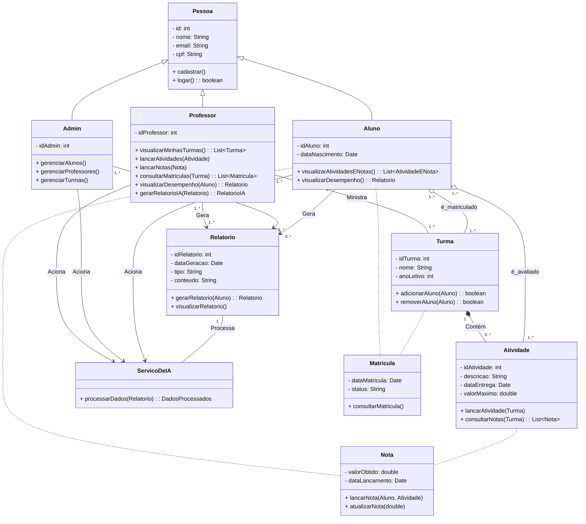

```mermaid
classDiagram
    direction TB
    
    %% CLASSES DE GENERALIZAÇÃO
    class Pessoa {
        - id: int
        - nome: String
        - email: String
        - cpf: String
        + cadastrar()
        + logar(): boolean
    }
    
    class Admin {
        - idAdmin: int
        + gerenciarAlunos()
        + gerenciarProfessores()
        + gerenciarTurmas()
    }
    
    class Professor {
        - idProfessor: int
        + visualizarMinhasTurmas(): List~Turma~
        + lancarAtividades(Atividade)
        + lancarNotas(Nota)
        + consultarMatriculas(Turma): List~Matricula~
        + visualizarDesempenho(Aluno): Relatorio
        + gerarRelatorioIA(Relatorio): RelatorioIA
    }
    
    class Aluno {
        - idAluno: int
        - dataNascimento: Date
        + visualizarAtividadesENotas(): List~AtividadeENota~
        + visualizarDesempenho(): Relatorio
    }
    
    %% CLASSES PRINCIPAIS
    class Turma {
        - idTurma: int
        - nome: String
        - anoLetivo: int
        + adicionarAluno(Aluno): boolean
        + removerAluno(Aluno): boolean
    }
    
    class Atividade {
        - idAtividade: int
        - descricao: String
        - dataEntrega: Date
        - valorMaximo: double
        + lancarAtividade(Turma)
        + consultarNotas(Turma): List~Nota~
    }
    
    class Relatorio {
        - idRelatorio: int
        - dataGeracao: Date
        - tipo: String
        - conteudo: String
        + gerarRelatorio(Aluno): Relatorio
        + visualizarRelatorio()
    }
    
    class ServicoDeIA {
        + processarDados(Relatorio): DadosProcessados
    }
    
    %% CLASSES DE ASSOCIAÇÃO
    class Matricula {
        - dataMatricula: Date
        - status: String
        + consultarMatricula()
    }
    
    class Nota {
        - valorObtido: double
        - dataLancamento: Date
        + lancarNota(Aluno, Atividade)
        + atualizarNota(double)
    }
    
    
    %% RELACIONAMENTOS

    %% Herança (Especialização/Generalização)
    Pessoa <|-- Admin
    Pessoa <|-- Professor
    Pessoa <|-- Aluno 
    
    %% Professor Ministra Turma
    Professor "1..*" -- "1..*" Turma : Ministra
    
    %% Turma Contém Atividades (Composição)
    Turma "1" *-- "0..*" Atividade : Contém
    
    %% Aluno e Turma (Matrícula - Classe de Associação)
    Aluno "1..*" o-- "1..*" Turma : é_matriculado
    Aluno .. Matricula
    Turma .. Matricula
    
    %% Aluno e Atividade (Nota - Classe de Associação)
    Aluno "1..*" o-- "1..*" Atividade : é_avaliado
    Aluno .. Nota
    Atividade .. Nota
    
    %% Regação de Relatórios
    Professor "1..*" --> "1..*" Relatorio : Gera
    Admin "1..*" --> "1..*" Relatorio : Gera
    Aluno "1" --> "0..*" Relatorio : Gera
    
    %% Relação com Serviço de IA
    Professor --> ServicoDeIA : Aciona
    Admin --> ServicoDeIA : Aciona
    Aluno --> ServicoDeIA : Aciona
    Relatorio "1" -- "1" ServicoDeIA : Processa
```