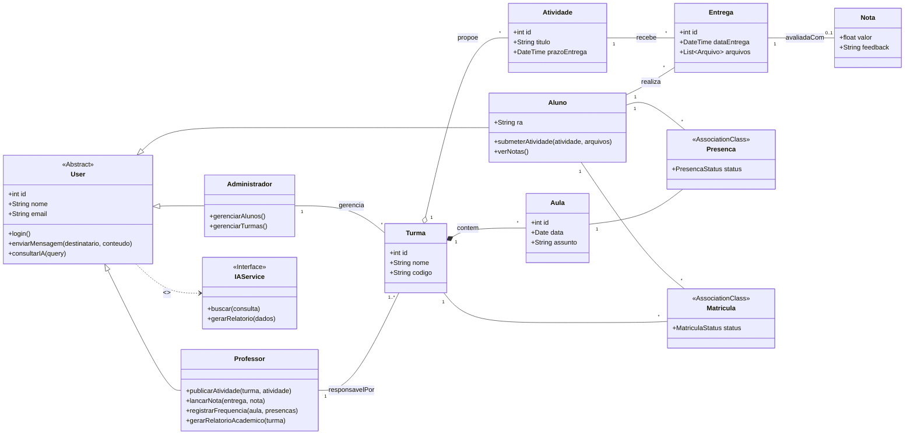

```mermaid
classDiagram
    direction LR

    class User {
        <<Abstract>>
        +int id
        +String nome
        +String email
        +login()
        +enviarMensagem(destinatario, conteudo)
        +consultarIA(query)
    }

    class Administrador {
        +gerenciarAlunos()
        +gerenciarTurmas()
    }

    class Professor {
        +publicarAtividade(turma, atividade)
        +lancarNota(entrega, nota)
        +registrarFrequencia(aula, presencas)
        +gerarRelatorioAcademico(turma)
    }

    class Aluno {
        +String ra
        +submeterAtividade(atividade, arquivos)
        +verNotas()
    }

    class Turma {
        +int id
        +String nome
        +String codigo
    }
    
    class Aula {
        +int id
        +Date data
        +String assunto
    }

    class Atividade {
        +int id
        +String titulo
        +DateTime prazoEntrega
    }

    class Entrega {
        +int id
        +DateTime dataEntrega
        +List~Arquivo~ arquivos
    }

    class Nota {
        +float valor
        +String feedback
    }

    class Presenca {
        <<AssociationClass>>
        +PresencaStatus status
    }

    class Matricula {
        <<AssociationClass>>
        +MatriculaStatus status
    }

    class IAService {
        <<Interface>>
        +buscar(consulta)
        +gerarRelatorio(dados)
    }

    %% --- Herança e Dependências ---
    User <|-- Administrador
    User <|-- Professor
    User <|-- Aluno
    
    User ..> IAService : <<usa>>

    %% --- Relacionamentos Principais (Sintaxe Universal) ---
    Administrador "1" -- "*" Turma : gerencia
    Professor "1" -- "1..*" Turma : responsavelPor
    
    Turma "1" *-- "*" Aula : contem
    Turma "1" o-- "*" Atividade : propoe
    
    Atividade "1" -- "*" Entrega : recebe
    Aluno "1" -- "*" Entrega : realiza
    
    Entrega "1" -- "0..1" Nota : avaliadaCom

    %% --- Classes de Associação (Sintaxe Universal) ---
    Aluno "1" -- "*" Presenca
    Aula "1" -- "*" Presenca
    
    Aluno "1" -- "*" Matricula
    Turma "1" -- "*" Matricula
```