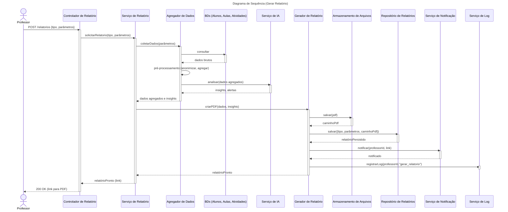

```mermaid
sequenceDiagram
    title Diagrama de Sequência (Gerar Relatório)

    actor Professor
    participant CR as Controlador de Relatório
    participant SR as Serviço de Relatório
    participant AD as Agregador de Dados
    participant BDs as BDs (Alunos, Aulas, Atividades)
    participant SIA as Serviço de IA
    participant GR as Gerador de Relatório
    participant AA as Armazenamento de Arquivos
    participant RR as Repositório de Relatórios
    participant SN as Serviço de Notificação
    participant SL as Serviço de Log

    Professor->>CR: POST /relatorios {tipo, parâmetros}
    activate CR

    CR->>SR: solicitarRelatorio(tipo, parâmetros)
    activate SR

    SR->>AD: coletarDados(parâmetros)
    activate AD

    AD->>BDs: consultar
    activate BDs
    BDs-->>AD: dados brutos
    deactivate BDs

    AD->>AD: pré-processamento (anonimizar, agregar)

    AD->>SIA: analisar(dados agregados)
    activate SIA
    SIA-->>AD: insights, alertas
    deactivate SIA

    AD-->>SR: dados agregados e insights
    deactivate AD

    SR->>GR: criarPDF(dados, insights)
    activate GR

    GR->>AA: salvar(pdf)
    activate AA
    AA-->>GR: caminhoPdf
    deactivate AA

    GR->>RR: salvar({tipo, parâmetros, caminhoPdf})
    activate RR
    RR-->>GR: relatórioPersistido
    deactivate RR

    GR->>SN: notificar(professorId, link)
    activate SN
    SN-->>GR: notificado
    deactivate SN

    GR->>SL: registrarLog(professorId,"gerar_relatorio")
    activate SL
    deactivate SL

    GR-->>SR: relatórioPronto
    deactivate GR

    SR-->>CR: relatórioPronto (link)
    deactivate SR

    CR-->>Professor: 200 OK (link para PDF)
    deactivate CR
```