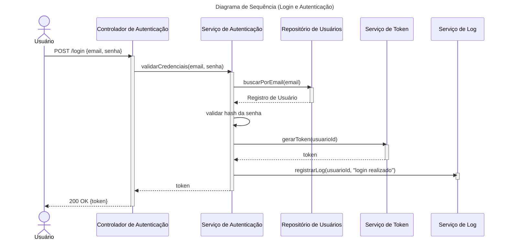

```mermaid
sequenceDiagram
    title Diagrama de Sequência (Login e Autenticação)

    actor Usuário
    participant CA as Controlador de Autenticação
    participant SA as Serviço de Autenticação
    participant RU as Repositório de Usuários
    participant ST as Serviço de Token
    participant SL as Serviço de Log

    Usuário->>CA: POST /login {email, senha}
    activate CA

    CA->>SA: validarCredenciais(email, senha)
    activate SA

    SA->>RU: buscarPorEmail(email)
    activate RU
    RU-->>SA: Registro de Usuário
    deactivate RU

    SA->>SA: validar hash da senha

    SA->>ST: gerarToken(usuarioId)
    activate ST
    ST-->>SA: token
    deactivate ST

    SA->>SL: registrarLog(usuarioId, "login realizado")
    activate SL
    deactivate SL

    SA-->>CA: token
    deactivate SA

    CA-->>Usuário: 200 OK {token}
    deactivate CA
```