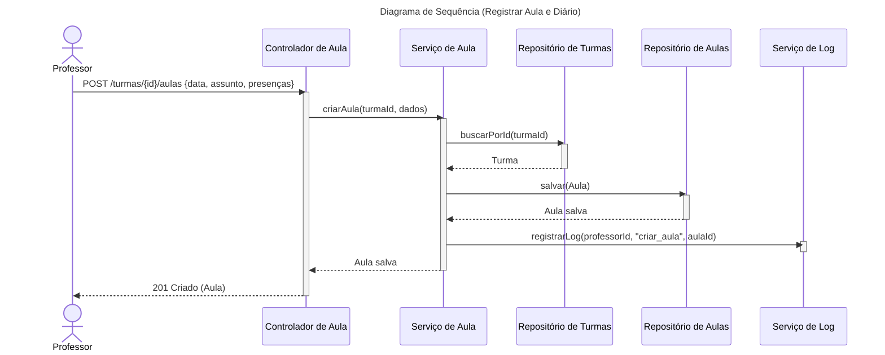

```mermaid
sequenceDiagram
    title Diagrama de Sequência (Registrar Aula e Diário)

    actor Professor
    participant CA as Controlador de Aula
    participant SA as Serviço de Aula
    participant RT as Repositório de Turmas
    participant RA as Repositório de Aulas
    participant SL as Serviço de Log

    Professor->>CA: POST /turmas/{id}/aulas {data, assunto, presenças}
    activate CA

    CA->>SA: criarAula(turmaId, dados)
    activate SA

    SA->>RT: buscarPorId(turmaId)
    activate RT
    RT-->>SA: Turma
    deactivate RT

    SA->>RA: salvar(Aula)
    activate RA
    RA-->>SA: Aula salva
    deactivate RA

    SA->>SL: registrarLog(professorId, "criar_aula", aulaId)
    activate SL
    deactivate SL

    SA-->>CA: Aula salva
    deactivate SA

    CA-->>Professor: 201 Criado (Aula)
    deactivate CA
```