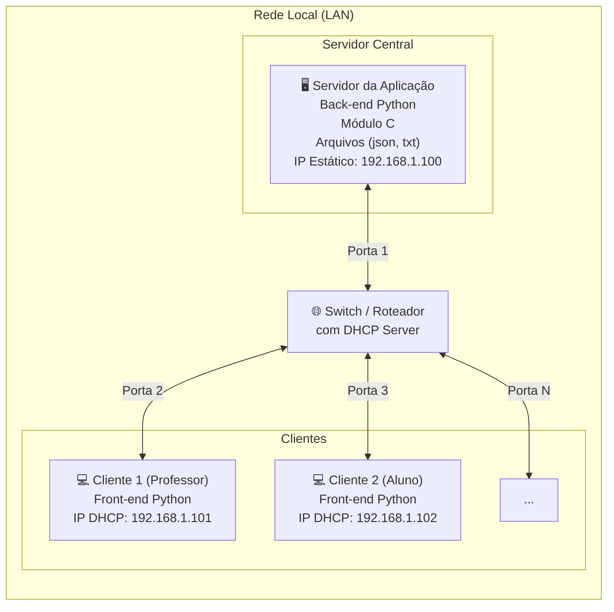

```mermaid
graph TD
    subgraph "Rede Local (LAN)"

        direction TB

        subgraph "Servidor Central"
            SVR["🖥️ Servidor da Aplicação
            Back-end Python
            Módulo C
            Arquivos (json, txt)
            IP Estático: 192.168.1.100"]
        end

        subgraph "Clientes"
            CLI1["💻 Cliente 1 (Professor)
            Front-end Python
            IP DHCP: 192.168.1.101"]
            CLI2["💻 Cliente 2 (Aluno)
            Front-end Python
            IP DHCP: 192.168.1.102"]
            CLIn[...]
        end

        SW["🌐 Switch / Roteador
        com DHCP Server"]

        SVR <-->|Porta 1| SW
        SW <-->|Porta 2| CLI1
        SW <-->|Porta 3| CLI2
        SW <-->|Porta N| CLIn
    end
```
