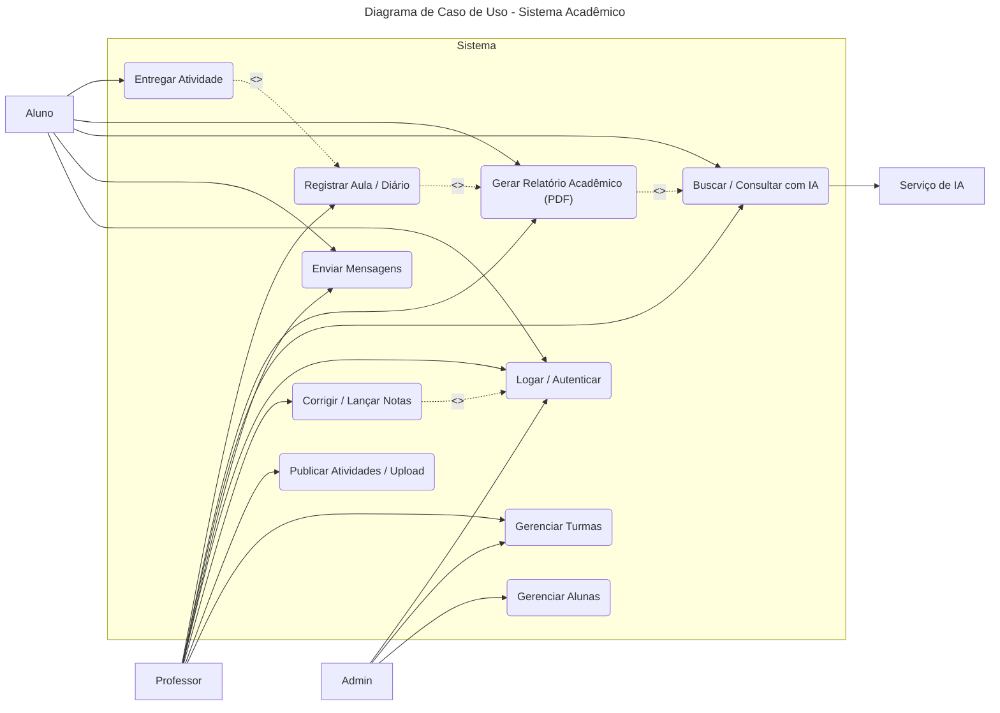

```mermaid
---
title: Diagrama de Caso de Uso - Sistema Acadêmico
---
graph LR
    %% Definição dos Atores
    Admin
    Professor
    Aluno
    ServicoIA[Serviço de IA]

    %% Bloco que representa o Sistema
    subgraph Sistema
        direction LR
        %% Definição dos Casos de Uso com IDs
        UC1("Gerenciar Alunas")
        UC2("Gerenciar Turmas")
        UC3("Publicar Atividades / Upload")
        UC4("Corrigir / Lançar Notas")
        UC5("Logar / Autenticar")
        UC6("Enviar Mensagens")
        UC7("Buscar / Consultar com IA")
        UC8("Gerar Relatório Acadêmico (PDF)")
        UC9("Registrar Aula / Diário")
        UC10("Entregar Atividade")
    end

    %% Conexões dos Atores com os Casos de Uso
    Admin --> UC1
    Admin --> UC2
    Admin --> UC5

    Professor --> UC2
    Professor --> UC3
    Professor --> UC4
    Professor --> UC5
    Professor --> UC6
    Professor --> UC7
    Professor --> UC8
    Professor --> UC9

    Aluno --> UC5
    Aluno --> UC6
    Aluno --> UC7
    Aluno --> UC8
    Aluno --> UC10

    %% Conexão com o Serviço Externo
    UC7 --> ServicoIA

    %% Relacionamentos entre Casos de Uso
    UC4 -.->|"<<consultar>>"| UC5
    UC8 -.->|"<<include>>"| UC7
    UC9 -.->|"<<extend>>"| UC8
    UC10 -.->|"<<include>>"| UC9
```
