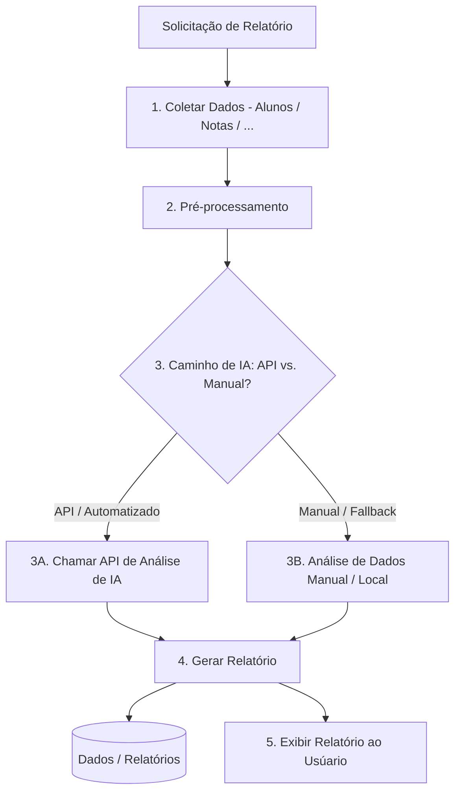

```mermaid
flowchart TB
  Pedido[Solicitação de Relatório] --> P5_1[1. Coletar Dados - Alunos / Notas / ...]
  P5_1 --> P5_2[2. Pré-processamento]

  %% Novo nó de Decisão
  P5_2 --> Decisao{3. Caminho de IA: API vs. Manual?}

  %% Caminho Automatizado (API)
  Decisao -- API / Automatizado --> P_API[3A. Chamar API de Análise de IA]
  P_API --> P_Gerar[4. Gerar Relatório]

  %% Caminho Manual (Fallback / Intervenção)
  Decisao -- Manual / Fallback --> P_Manual[3B. Análise de Dados Manual / Local]
  P_Manual --> P_Gerar

  %% Junção e Saída
  P_Gerar --> DS6[(Dados / Relatórios)]
  P_Gerar --> Exibicao[5. Exibir Relatório ao Usúario]
```
