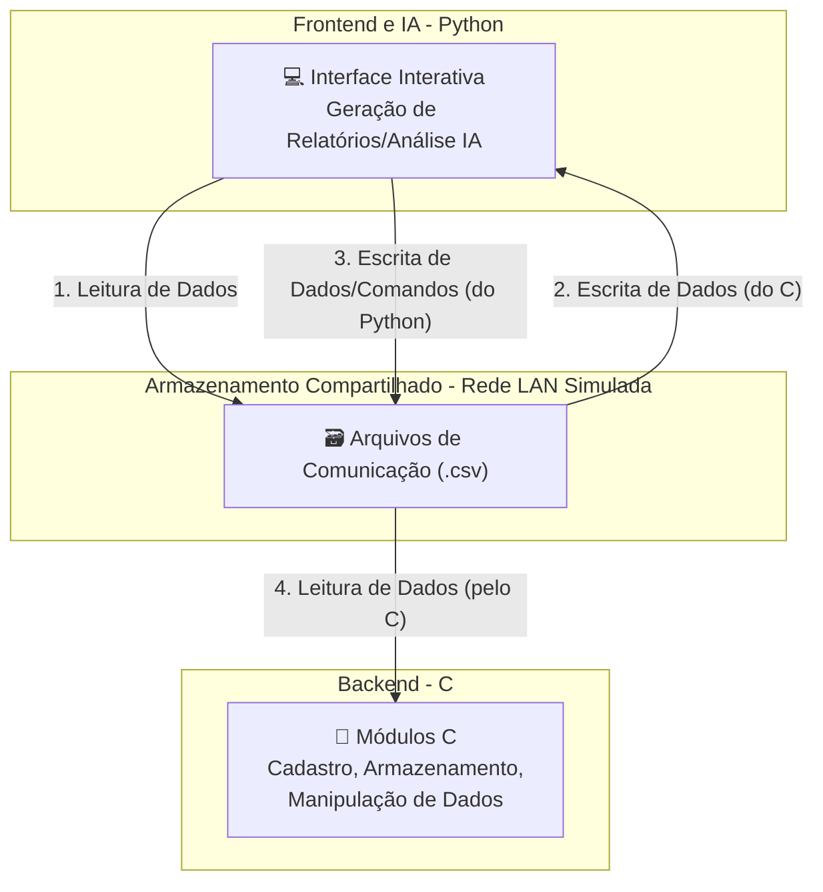

```mermaid
graph TD
    subgraph "Frontend e IA - Python"
        FP[💻 Interface Interativa<br>Geração de Relatórios/Análise IA]
    end

    subgraph "Backend - C"
        BC[🚀 Módulos C<br>Cadastro, Armazenamento,<br>Manipulação de Dados]
    end

    subgraph "Armazenamento Compartilhado - Rede LAN Simulada"
        CSV["🗃️ Arquivos de Comunicação (.csv)"]
    end

    FP -- 1. Leitura de Dados --> CSV
    CSV -- 2. Escrita de Dados (do C) --> FP
    FP -- 3. Escrita de Dados/Comandos (do Python) --> CSV
    CSV -- 4. Leitura de Dados (pelo C) --> BC
```
