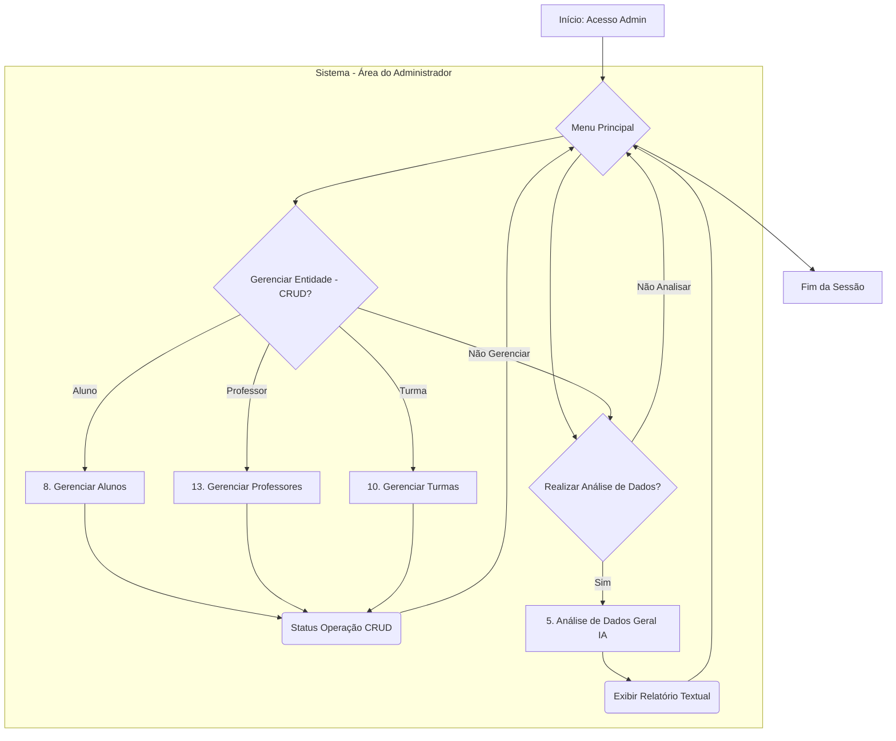

```mermaid

graph TD
    A[Início: Acesso Admin] --> B{Menu Principal};

    subgraph Sistema - Área do Administrador
        direction LR %% 'LR' para layout da esquerda para a direita dentro do subgrafo
        B --> C{Gerenciar Entidade - CRUD?};
        B --> H{Realizar Análise de Dados?};

        %% Fluxo de Gerenciamento (CRUD)
        C -- Aluno --> D[8. Gerenciar Alunos];
        C -- Professor --> F[13. Gerenciar Professores];
        C -- Turma --> G[10. Gerenciar Turmas];
        D --> E(Status Operação CRUD);
        F --> E;
        G --> E;
        E --> B;
        C -- Não Gerenciar --> H;

        %% Fluxo de Análise e IA (Simplificado)
        H -- Sim --> I[5. Análise de Dados Geral IA];
        I --> J(Exibir Relatório Textual);
        J --> B;
        H -- Não Analisar --> B;      

    end
    B --> Z[Fim da Sessão];

```
