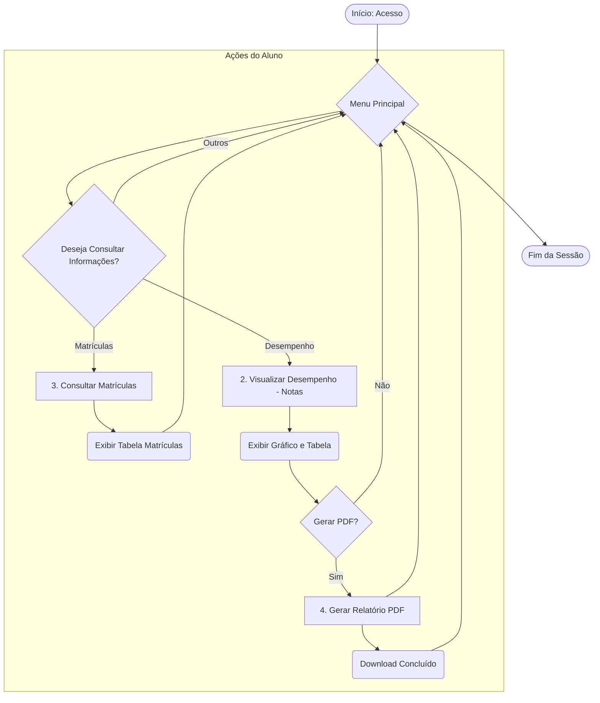

```mermaid

graph TD
    A([Início: Acesso]) --> B{Menu Principal};
    
    subgraph Ações do Aluno
        B --> C{Deseja Consultar Informações?};
        
        C -- Matrículas --> D[3. Consultar Matrículas];
        D --> E(Exibir Tabela Matrículas);
        
        C -- Desempenho --> F[2. Visualizar Desempenho - Notas];
        F --> G(Exibir Gráfico e Tabela);
        
        G --> H{Gerar PDF?};
        H -- Sim --> I[4. Gerar Relatório PDF];
        I --> J(Download Concluído);
        
        I --> B; 
        J --> B;
        
        H -- Não --> B;
        E --> B;
        C -- Outros --> B;
    end
    
    B --> Z([Fim da Sessão]);

```
