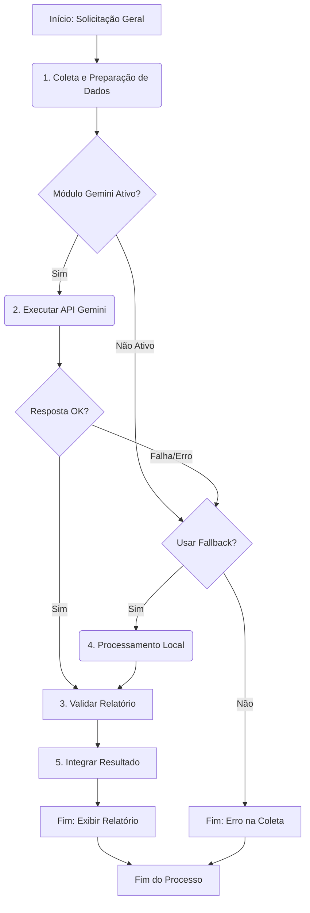

```mermaid

graph TD
    A[Início: Solicitação Geral] --> B(1. Coleta e Preparação de Dados);
    
    B --> C{Módulo Gemini Ativo?};
    
    %% Caminho Principal: Gemini
    C -- Sim --> D(2. Executar API Gemini);
    D --> E{Resposta OK?};
    
    %% Caminho de Fallback
    C -- Não Ativo --> G{Usar Fallback?};
    E -- Falha/Erro --> G;
    
    G -- Sim --> H(4. Processamento Local);
    G -- Não --> K[Fim: Erro na Coleta];

    %% Junção e Saída
    E -- Sim --> F[3. Validar Relatório];
    H --> F;

    F --> I[5. Integrar Resultado];
    
    I --> M[Fim: Exibir Relatório];
    M --> Z[Fim do Processo];
    K --> Z;

```
