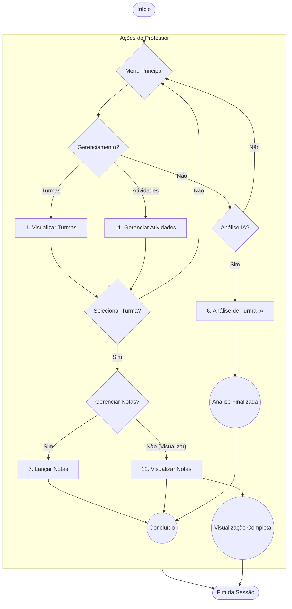

```mermaid

graph TD
    A([Início]) --> B{Menu Principal};
    
    subgraph Ações do Professor
        B --> C{Gerenciamento?};
        
        C -- Turmas --> D[1. Visualizar Turmas];
        D --> E{Selecionar Turma?};

        C -- Atividades --> F[11. Gerenciar Atividades];
        F --> E;

        E -- Sim --> G{Gerenciar Notas?};
        
        G -- Sim --> H[7. Lançar Notas];
        H --> I((Concluído));
        
        G -- Não (Visualizar) --> J[12. Visualizar Notas];
        J --> K((Visualização Completa));
        
        E -- Não --> B;

        C -- Não --> L{Análise IA?};
        
        L -- Sim --> M[6. Análise de Turma IA];
        M --> N((Análise Finalizada));
        L -- Não --> B;
    end
    
    J --> I;
    N --> I;
    I --> Z([Fim da Sessão]);
    K --> Z;

```